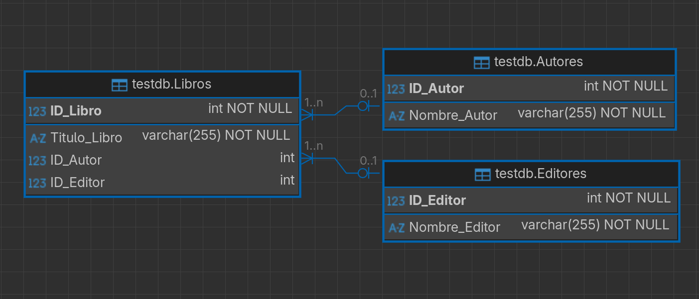

# Base de datos de Biblioteca - 3FN

Este proyecto contiene los scripts necesarios para crear y poblar una base de datos para el registro de libros en una biblioteca, normalizada hasta la Tercera Forma Normal (3FN).

## Diagrama ER

## Contenido

- `base_creation.sql`: Script SQL que crea las tablas `Autores`, `Editores` y `Libros`, define las claves primarias y foráneas, e incluye algunos registros de ejemplo.
- `assets/diagrama_erd.png`: Diagrama ERD.
- `README.md`: Este archivo.

## Requisitos

- Sistema de gestión de bases de datos relacionales (MySQL, PostgreSQL, SQL Server, etc.).
- Cliente SQL para ejecutar el script.

## Instrucciones de uso

1. Crear una base de datos vacía en su SGBD preferido.
2. Ejecutar el script `base_creation.sql` para crear las tablas e insertar datos de ejemplo.
3. Crear el diagrama con erd en tu SGBD (dbeaver).
